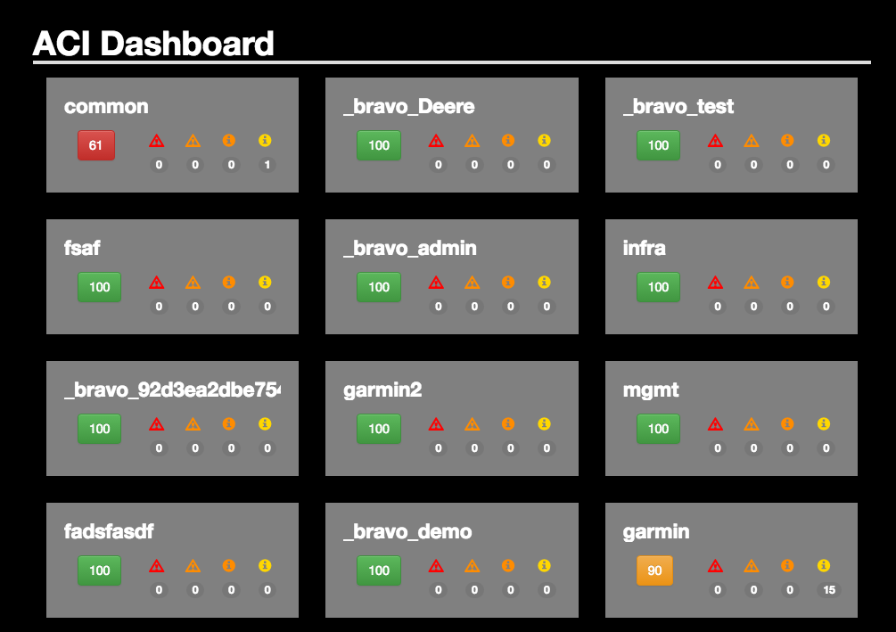
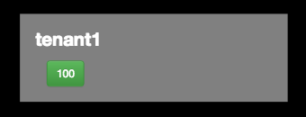
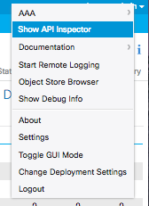

# aci-dashboard-tutorial

Creates an ACI Dashboard that displays tenant health scores and fault information 

## Technologies Used

* Python
* Flask
* bootstrap
* CSS
* ReactJS
* Docker




## Requirements

* Docker - https://www.docker.com/products/docker
* APIC controller - If you do not have access to your own APIC controller, you can use one of the DevNet sandboxes
located at https://developer.cisco.com/site/devnet/sandbox/available-labs/data-center/index.gsp

### Lab Exercise

We will create this application in a few distinct phases

* Create an API which returns all of the data we will need for our dashboard
* Retrieve and create a representation of that data using [ReactJS](https://facebook.github.io/react/)
* Make the data look pretty using cascading style sheets


#### Setup

The basic framework for our application is already in place, we need to add a few environment variables with our APIC location

## Docker Enviornment

We will be developing our application using Docker, but we need a way to pass runtime information about the APIC controller we will be using to get our data from.  


Modify the [./ENVIORNMENT](./ENVIRONMENT) file with your APIC information.
```
APIC_LOGIN=admin
APIC_URL=http://10.94.140.72
APIC_PASSWORD=ins3965!

```

Whenever we make changes to our application, we will rebuild our image with the latest changes prior to running.

From your project directory run the following command to build your image
```
docker build -t myapp .
```

We will pass these variables into the docker container at runtime, as well as expose the port that our development server will be running on using the `--publish` flag (`-p ` for short)
```
docker run -ti --env-file ENVIRONMENT -p 5000:5000 myapp
```

Your app should now be accessible at http://127.0.0.1:5000


### API Layer

#### Getting tenants

The foundation for our application is a list of tenants, we will start by modifying the `get_tenants()` in [./aci-dashboard-tutorial.py](./aci-dashboard-tutorial.py). This function should return a list of ACItoolkit tenant objects.  If you are unsure how to do this, you may want to look at the ACI Toolkit Documentation [here](http://acitoolkit.readthedocs.io/en/latest/subscriptions.html)

Your application should now return a list of all of the tenants

#### Health Scores

One of the most valuable pieces of information that APIC provides is a tenant health score, a health score is a simple representation on a scale of 0-100 of the current state of a tenant is.  

Modify the `get_tenant_healthscore(obj)` function to return the *current* healthscore

*HINT:* review the source code here https://github.com/datacenter/acitoolkit/blob/master/acitoolkit/aciHealthScore.py

At this point in our application, we have the basic tenant list and corresponding health score for each tenant.  Next we will make some modifications to the way that our tenant list is displayed

### ReactJS

React is a component based, components manage their own state, then compose themselves into divisions (divs) of an HTML page, they will also populate the divs with class names that can be styled with CSS.

For this section we will manipulating javascript code located in [./static/scripts/aci.js](./static/scripts/aci.js)

Our initial representation of the tenant object looks like this:

```

 var AciTenant = React.createClass({

   render: function() {
     return (
       // This is where we render the html representation of the object
       // <div className="foo"> here will render as <div class="foo">
       // start as a simple list, comment this line out and add your code below
       <li>{this.props.name} - {this.props.score}</li>
     // End html representation
     );
   },
   dynamicButton: function(){

```

The first thing we will want to do is leverage some built in classes from Bootstrap as well as create some of our own. Bootstrap includes a responsive grid of 12 columns. This grid system is nested, so that within each div you have the same 12 column grid. Detailed information about the grid
system can be found at http://getbootstrap.com/css/#grid-example-basic

```
<div className="col-sm-4">
    <div className="tile gray">
      <h3 className="title">
        {this.props.name}
      </h3>

     <div className="health">
       <div className="col-sm-4">
         <button className="btn btn-success">{this.props.score}</button>
       </div>
     </div>
   </div>
</div>
```

We've used some components builtin to bootstrap
* col-sm-4 - this creates a column that is 1/3 of the screen in width
* btn btn-success - a common button class

We've also defined three new classes
* tile gray
* title
* health

Let's add the styling to [./static/css/base.css](./static/css/base.css)
A full CSS reference can be found at http://www.w3schools.com/cssreF/

```
.tile {
    width: 100%;
    display: inline-block;
    box-sizing: border-box;
    padding: 20px;
    margin-bottom: 30px;
}

.tile .title {
    margin-top: 0px;
    overflow: hidden;
}

.tile.gray {
    background: gray;
}

```
Now when React renders an ACI tenant, it will create a tile that looks like this:




### Faults
Our app is almost done, but we would also like to create fault indicators our tenant tiles. To do so we will use bootstrap components called glyphicons or glyphs.  These are reusable icons for our web application.

The process here will be the same as the previous steps:

#### 1. Collect fault data from APIC
ACI toolkit currently does not have any fault functionality, so we will have to do some manual REST calls.  We can still leverage the toolkit for basic authentication and session management through the `.get()` method of our Session object. Examine the source code at https://github.com/datacenter/acitoolkit/blob/master/acitoolkit/acisession.py#L642 and you will see that this method allows us to pass a string which represents any API endpoint on the controller, and returns a generic response class instance from requests.

One of the most valuable tools for working with ACI is the API inspector.  All of the
information that is rendered on the APIC GUI is retrieved using API calls on the backend, not too much differently than what our application is doing. Each tenant dashboard already displays the fault data we are actually looking for, so we will use the API inspector to
find out the API endpoint we need to request this information from

Login to your APIC controller, and turn on the API Inspector from the "welcome, username" drop down menu
in the upper right hand corner of the screen



From here you should be able to identify an endpoint that will return fault count information by severity.
With this information, modify the `get_tenant_faultcounts(obj)` function in [./aci-dashboard-tutorial.py](./aci-dashboard-tutorial.py)
to return this information.  

2. Make it available via our API

We will also add keys to the dictionary that gets created for each tenant object in the `dash()` function, adding the following keys
with the appropriate values:

* crit
* major
* warn
* minor


3. Modify ReactJS to render the new information in our tile. This information will be placed
in our existing <div className="health"> in [./static/scripts/aci.js](./static/scripts/aci.js)


```
     <div className="col-sm-2">
       <span className="glyphicon glyphicon-warning-sign" style={{color:"red"}}></span>
         <span className="badge">{this.props.crit}</span>
     </div>

     <div className="col-sm-2">
       <span className="glyphicon glyphicon-warning-sign" style={{color:"darkorange"}}></span>
         <span className="badge">{this.props.maj}</span>
     </div>

     <div className="col-sm-2">
         <span className="glyphicon glyphicon-info-sign" style={{color:"darkorange"}}></span>
           <span className="badge">{this.props.warn}</span>
     </div>

     <div className="col-sm-2">
         <span className="glyphicon glyphicon-info-sign" style={{color:"gold"}}></span>
           <span className="badge">{this.props.minor}</span>
     </div>

```


## Bonus Challenges

1. The app is currently creating static green buttons for the healh score using the btn btn-success class, create a function in aci.js  which dynamically changes the color of the button based on the health score.

2. Create a button at the top of the page representing the health score of the entire fabric.
